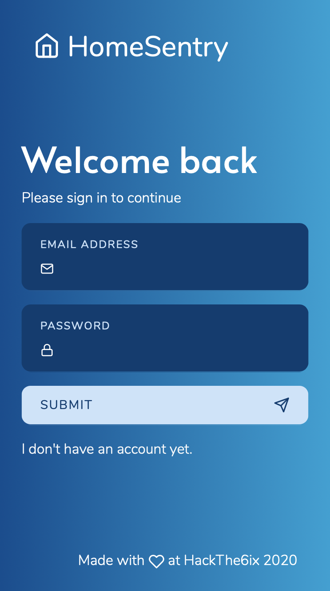
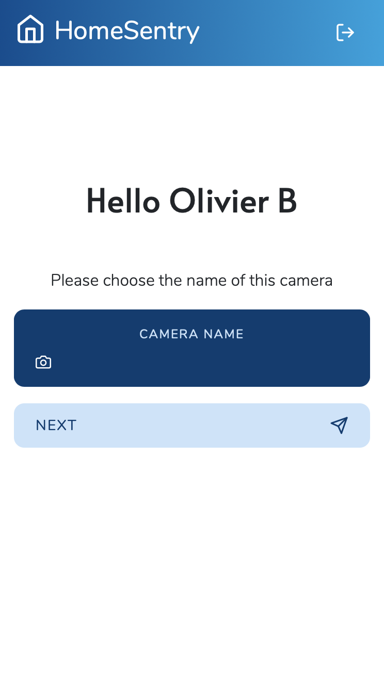
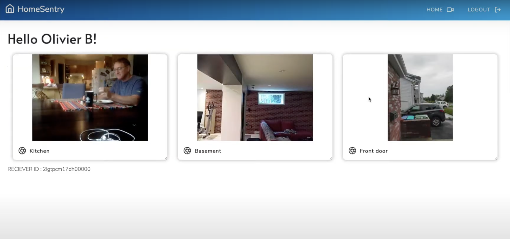

# HomeSentry
HomeSentry is an open source platform that turns your old phones into a distributed security camera system. Simply install our app on any mobile device and start monitoring your home easily !

**Made with :heart: by [@ChristopherSt-Pierre](https://github.com/ChristopherSt-Pierre), [@VinConstantin](https://github.com/VinConstantin), [@charliesis](https://github.com/charliesis) and [@obrassard](https://github.com/obrassard) at HackThe6ix 2020**

> Demo here : https://www.youtube.com/watch?v=SoRZkp_e9fs

### Check it out !

| Environment | Url |
| ----------- | --- |
| HomeSentry Server | http://homesentry.azurewebsites.net   https://homesentry-server.cloud.obrassard.ca |
| HomeSentry Dashboard | https://homesentry.netlify.app |
| HomeSentry Mobile Client | https://homesentry-mobile.netlify.app |

### Built with 

    
    
    
       
    
    
    
    
    
    

## Screenshots 

# The project 

HomeSentry is an open source platform that turns your old phones or any devices into a distributed security camera system. Simply install our app on any mobile device and start monitoring your home (or any other place). HomeSentry gives a new life to your old devices while bringing you the peace of mind you deserve!

## Inspiration

We all have old phones stored in the bottom of a drawer waiting to be used for something. This is where the inspiration for HomeSentry came from. Indeed, We wanted to give our old cellphone and electronic devices a new use so they don't only collect dust over time. Generally speaking, every cellphone have a camera that could be used for something, and we thought using it for security reason would be a great idea. Home surveillance camera systems are often very expensive, or are complicated to set up. Our solution is very simple and costs close to nothing since it's equipment you already have.

## How it works

HomeSentry turns your old cellphones into a complete security system for your home. It's a modular solution where you can register as many devices as you have at your disposition. Every device are linked to your account and automatically stream their camera feed to your personnal dashboard in real time. You can view your security footage from anywhere by logging in to your HomeSentry dashboard.

## How we built it

The HomeSentry platform is constituted of 3 main components :

#### 1. HomeSentry Server

The server main responsibility is responsible to handle all authentication requests and orchestrate cameras connections. It is indeed in charge of connecting the mobile app to users' dashboard so that it may get the live stream footage. This server is built with node.js and uses a MongoDB to store user accounts.

#### 2. HomeSentry Mobile app

The user goes on the app from his cellphone and enters his credentials. He may then start streaming the video from his camera to the server. The app is currently a web app build with the Angular Framework. We plan to convert it to an Android/iOS application using Apache Cordova at a later stage.

#### 3. HomeSentry Dashboard

The dashboar is the user main management panel. It allows the user to watch all of the streams he his receiving from the connected cellphones. The website was also built with Angular.

## Technology

On a more technical note, this app uses several open sources framework and library in order to accomplish it work. Here's a quick summary.

The NodeJS server is built with TypeScript, Express.JS. We use Passport.JS + MongoDB as our authentication system and SocketIO to exchange real time data between every user's devices (cameras) and the dashboard.

On mobile side we are using WebRTC to access the devices' camera stream and to link it to the dashboard. Every camera stream is distributed by a peer to peer connection with the web dashboard when it become active. This ensures the streams privacy and reduce video latency. We used Peer.JS and SocketIO to implement this mecanism.

Just like the mobile client, the web dashboard is built with Angular and frontend libraries such as Bootstrap or feather-icons.

## Challenges we ran into (and what we've learned)

Overall we've learned that sending live streams is quite complicated !
We had underestimated the effort required to send and manage this feed. While working with this type of media, we learned how to communicate with WebRTC. At the begining, we tried to do all the stuff by oursef and use different protocols such as RTMP, but we come to a point where it was a little buggy. Late in the event, we found and used the PeerJS lib to manage those streams and it considerably simplified our code.

We found that working with mobile applications like Xamarin is much more complicated for this kind of project. The easiest way was clearly javascript, and it allow a greater type of device to be registered as cameras. 

The project also help us improved our knowledge of real time messaging and WebSocket by using SocketIO to add a new stream without having to refresh the web page.

We also used an authentication library we haven't used yet, called PassportJS for Node. With this we were able to show only the streams of a specific user.

We hosted for the first time an appservice with NodeJS on Azure and we configure the CI from GitHub. It's nice to see that they use Github Action to automate this process.

We've finally perfected ourselves on various frontend technologies such as Angular.

## What's next for HomeSentry

HomeSentry works very well for displaying feeds of a specific user. Now, what might be cool is to add some analytics on that feed to detect motion and different events. We could send a notification of these movements by sms/email or even send a push notification if we could compile this application in Cordova and distribute it to the AppStore and Google Play. Adding the ability to record and save the feed when motion is detected could be a great addition. With detection, we should store this data in local storage and in the cloud. Working offline could also be a great addition. At last improve quality assurance to ensure that the panel works on any device will be a great idea.

We believe that HomeSentry can be used in many residences and we hope this application will help people secure their homes without having to invest in expensive equipments.
